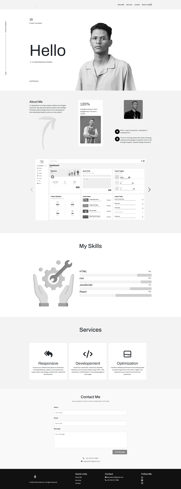

# Abdelrahman Khalid — Portfolio

## 👋 About Me
Hello! I’m **Abdelrahman Khalid**, a front-end developer with skills in **HTML, CSS, JavaScript**, plus **Bootstrap** and **SwiperJS**.  
I build clean, responsive designs focused on good user experience and visual appeal.  
Contact: IIaboody101@gmail.com

---

## 💻 Technologies & Tools
- HTML5  
- CSS3  
- JavaScript  
- Bootstrap  
- SwiperJS  

---

## 📂 Projects

| Name | Description |
|-------|-------------|
| **Zero Design - Layouts 2, 3 & 4** | Part of the “Zero Design” series. Designed multiple layouts with focus on responsive design, clean UI, typography, and CSS layout techniques. |
| **Mods Restaurant (soon)** | A restaurant style web design project in progress (“soon”). |
| **Bealthy (soon)** | A fitness site to help people follow workout routines and build a strong, healthy physique in progress (“soon”). |

---

## 🔎 What I Focus On

- Clean, minimal design styles  
- Responsive layouts – work well on mobile, tablet, desktop  
- Good typography and color consistency  
- Smooth interactions & sliders (using SwiperJS)  
- Practical use of Bootstrap for layout + responsive utilities  

---

## 🚀 How to Try / See My Work

1. Clone or download my portfolio repository.  
2. Open `index.html` in a web browser for the live demo.  
3. Make sure your internet connection is active if external resources (fonts, Bootstrap, Swiper) are loaded via CDNs.  
4. Resize the browser or test on different devices to see responsiveness.

---

## 📸 Screenshots

Here’s an example interface from one of my designs:

---

## 🧠 Challenges & Learning

- Ensuring consistent look across screen sizes  
- Managing dependencies (Bootstrap, SwiperJS) without bloating the design  
- Fine-tuning visual styles: spacing, typography, contrast  
- Keeping the site performant and smooth  

---

## ⭐ What I’m Working On

- Completing the “Mods Restaurant” design and launching it fully  
- Adding more interactive features (hover effects, transitions)  
- Possibly integrating backend or dynamic content later  
- Continuous improvements to mobile/UX

---

## 📜 License

This portfolio and its code are licensed under the **MIT License**.

---

